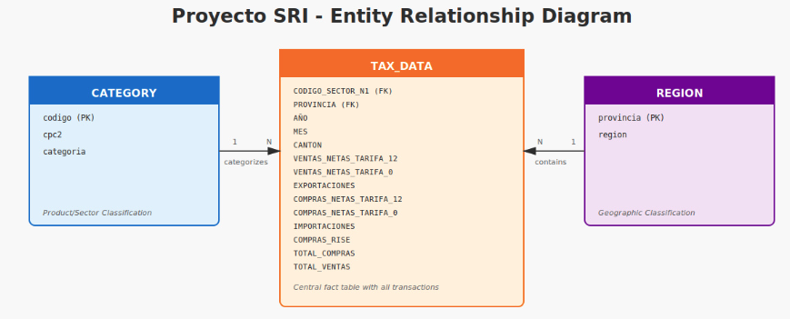
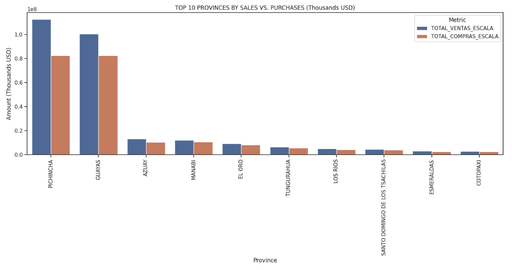
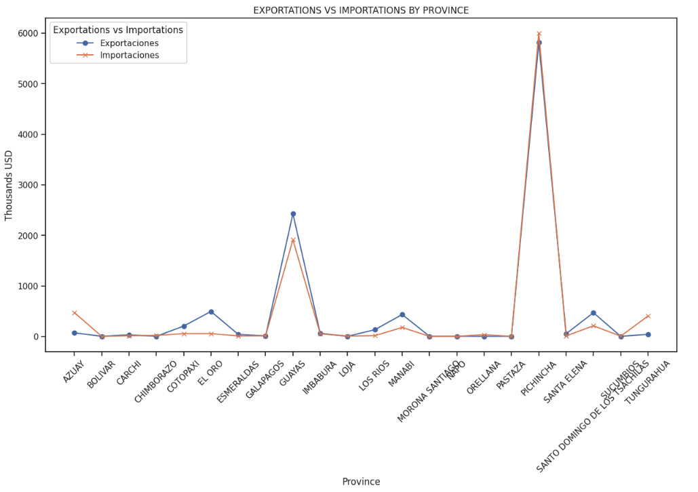
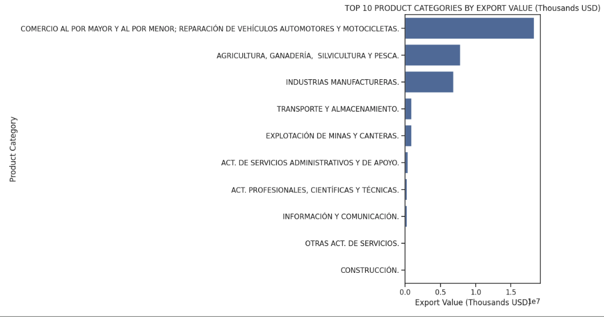
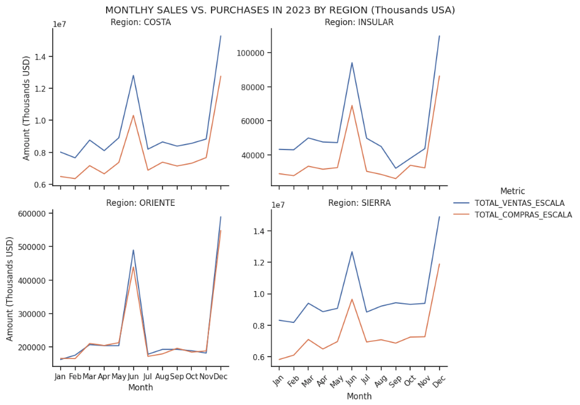
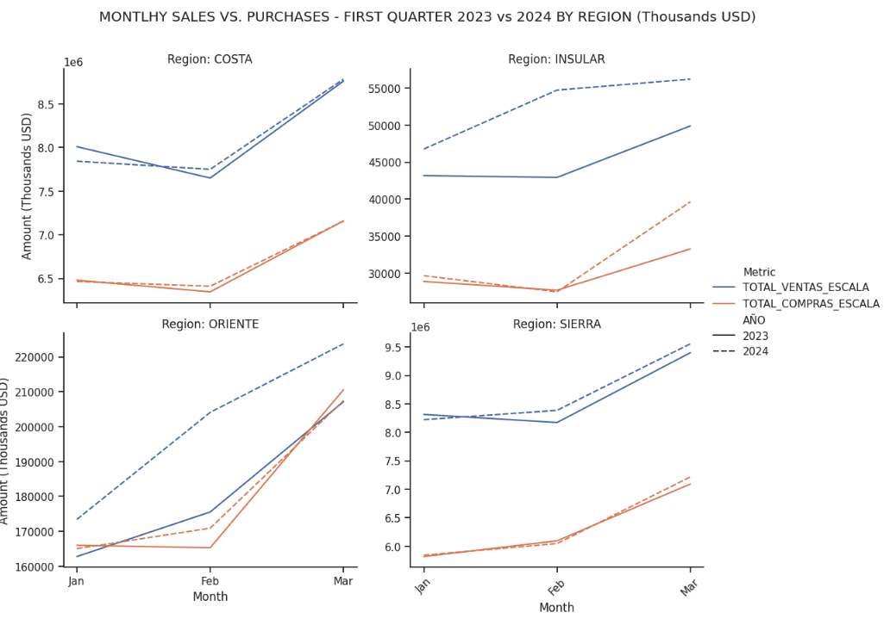
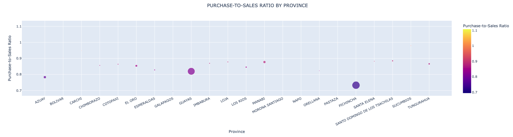

# 📊 Provincial Economic Analysis - Ecuador Tax Revenue SRI
 
## Table of Contents
 
* [Project Overview](#project-overview)
* [Executive Summary](#1-executive-summary)
* [Business Context](#2-business-context)
* [Analysis](#3-analysis)
  * [Key Metrics by Province](#key-metrics-by-province)
  * [Product Category Export Leaders](#product-category-export-leaders)
  * [Temporal Trend: Sales & Purchase Activity](#temporal-trend-sales--purchase-activity)
  * [Regional Disparity Index](#regional-disparity-index)
* [Key Insights](#4-key-insights)
* [Recommendations](#5-recommendations)
  * [Immediate Actions](#immediate-actions)
  * [Strategic Initiatives](#strategic-initiatives)
  * [Long-Term Opportunities](#long-term-opportunities)
* [Methodology](#methodology)
* [Full Analysis](#-full-analysis)
* [Contact](#-contact)
 
---
 
## Project Overview
 
Project SRI is a data analysis case study inspired by Ecuador's Servicio de Rentas Internas (SRI). The project analyzes provincial tax data to evaluate economic activity across regions and deliver clear, actionable insights for business and public-sector stakeholders.
 
The focus of this project is on **data cleaning, exploratory analysis, trend evaluation, and insight communication**—core responsibilities of a data analyst role.
 
---
 
## 1. Executive Summary
 
* **Goal:** Analyze Ecuador's provincial tax data to identify regional economic drivers, export leaders, and purchasing-to-sales disparities that inform business and policy decisions.

 
* **Key Insights:** 
  - A small number of provinces are disproportionate drivers of national export activity
  - Several provinces demonstrate strong purchasing power without corresponding sales growth, indicating inefficiencies or untapped market opportunities
  - Regional economic momentum has shifted measurably post-2023, aligning with the government transition
 
* **Business Impact:** Stakeholders can now target high-growth provinces for investment, identify provinces with supply-chain bottlenecks, and adjust regional strategies based on real economic activity patterns.
 
---
 
## 2. Business Context
 
**Dataset Overview:**  
This analysis leverages provincial-level tax data from Ecuador's Servicio de Rentas Internas (SRI), capturing:
- Sales activity by province
- Purchase activity by province
- Export volume and product categories
- Temporal trends during 2023 and comparison between 1st quarter 2023 vs 2024 
 
**Why It Matters:**  
Regional economic disparities affect business expansion strategies, government resource allocation, and export competitiveness. Understanding which provinces drive growth versus which have untapped potential helps stakeholders make data-informed decisions on investment, infrastructure, and trade policy.
 
---
 
## 3. Analysis
 
### Key Metrics by Province (Sales, Purchases, Exports)
 
*The top 10 provinces by sales demonstrate significant economic concentration, with Pichincha and Guayas commanding over 80% of total sales activity. Both provinces maintain healthy sales-to-purchases ratios, confirming their status as dominant economic and export hubs. The remaining eight provinces contribute substantially less, highlighting regional economic disparities*

*The Exportations vs. Importations analysis by province reveals stark disparities in international trade activity. Pichincha dominates both exports and imports, reflecting its status as Ecuador's primary commercial hub. Most provinces show minimal trade activity, indicating concentrated international commerce in a single province.*

### Product Category Export Leaders
 
*Identifying which product categories dominate Ecuador's export portfolio by volume and value.*
 

 
### Sales & Purchase Activity 2023 and Quaterly comparison 2023 vs 2024

*In 2023, the Costa, Insular, and Sierra regions dominated sales activity, with significantly higher sales volumes compared to purchases. This indicates these regions are primary export drivers for the national economy.*
#Sales (blue line) and Purchases (orange line)  

*First quarter 2024 data shows strong sales growth in the Insular and Oriente regions. Both regions outperformed their 2023 baselines, with Insular showing steady upward momentum and Oriente demonstrating accelerating sales trends—indicating improved export competitiveness.*
 

 
### Regional Disparity: Purchase-to-Sales 

*Ecuador's provinces fall into two main economic categories based on their Purchase-to-Sales Ratio:
Export Leaders (Pichincha & Guayas): These provinces sell significantly more than they purchase, indicating strong production and export capabilities. They drive national trade competitiveness.
Balanced Economies (Santo Domingo, El Oro, Manabí): These provinces maintain roughly equal purchasing and sales activity, reflecting stable, self-sufficient regional economies.
Notably: No provinces depend heavily on imports, suggesting a generally production-oriented national economy.*

 
---
 
## 4. Key Insights
 
✔ **Export Concentration Risk:** A disproportionately small set of provinces generates the majority of exports, creating economic vulnerability if these regions experience disruption.
 
✔ **Purchase-Sales Mismatch:** Several provinces show robust purchasing activity without corresponding sales growth, suggesting:
- Supply chain inefficiencies
- Inventory holding without retail movement
- Untapped demand in these regions
 
✔ **Post-2023 Economic Shift:** Measurable changes in activity levels and regional patterns post-transition indicate either structural economic shifts or policy impacts requiring investigation.
 
✔ **Category Concentration:** A limited number of product categories dominate exports by value, indicating specialization and potential vulnerability to commodity price fluctuations.
 
✔ **Regional Disparities:** Economic momentum is unevenly distributed; some provinces are growth engines while others remain underperformers despite purchasing power.
 
---
 
## 5. Recommendations
 
### Immediate Actions
1. **Investigate Purchase-Sales Mismatches:**  
   Conduct targeted interviews or on-site assessments in provinces with high purchasing but low sales. Identify root causes (logistics, pricing, demand generation, or market barriers).
 
2. **Diversify Export Base:**  
   Develop targeted support for underperforming provinces with latent export potential. Consider trade missions, product development incentives, or supply-chain optimization.
 
3. **Monitor Post-2023 Trends:**  
   Establish a quarterly monitoring cadence to track whether the post-2023 shift represents a new baseline or a temporary anomaly.
 
### Strategic Initiatives
4. **Export-Led Growth Program:**  
   Partner with top-performing provinces to understand their success factors, then replicate best practices in lower-performing regions.
 
5. **Supply-Chain Efficiency Study:**  
   For provinces with strong purchasing but weak sales, conduct a supply-chain audit to remove bottlenecks (storage, distribution, last-mile delivery).
 
6. **Product Category Risk Assessment:**  
   Evaluate vulnerability of leading export categories to price volatility, demand shocks, or trade policy changes. Encourage diversification.
 
### Long-Term Opportunities
7. **Interactive Dashboard & Automation:**  
   Deploy Power BI or Tableau dashboards for real-time regional monitoring. Automate monthly provincial reports for stakeholder distribution.
 
8. **Expand Dataset:**  
   Integrate additional economic indicators (employment, FDI, infrastructure investment) to build a richer regional economic profile.
 
9. **Predictive Analytics:**  
   Develop forecasts for provincial economic activity and export trends to enable proactive policy and investment decisions.
 
---
 
## 📊 Methodology
 
**Data Preparation:** Cleaned and validated raw tax data, handled missing values, and standardized provincial classifications.
 
**Exploratory Analysis:** Assessed distributions, correlations, and outliers across sales, purchases, and export dimensions.
 
**Trend Analysis:** Compared post-2023 activity to quantify economic shifts.
 
**Visualization & Reporting:** Translated findings into business-friendly visuals and actionable narratives.
 
**Tools Used:** Python (Pandas, NumPy), Matplotlib, Seaborn, Jupyter Notebooks
 
---
 
## 📓 Full Analysis
 
[Open Jupyter Notebook →](./Project_SRI.ipynb)
 
---
 
## 📧 Contact {#-contact}
 
**Elena Jones**  
📧 [elcjones@proton.me](mailto:elcjones@proton.me)  
💼 [LinkedIn](https://www.linkedin.com/in/elenajoneslc/)

**Elena Jones** | 📧 [elcjones@proton.me] | 💼 [LinkedIn](https://www.linkedin.com/in/elenajoneslc/)
