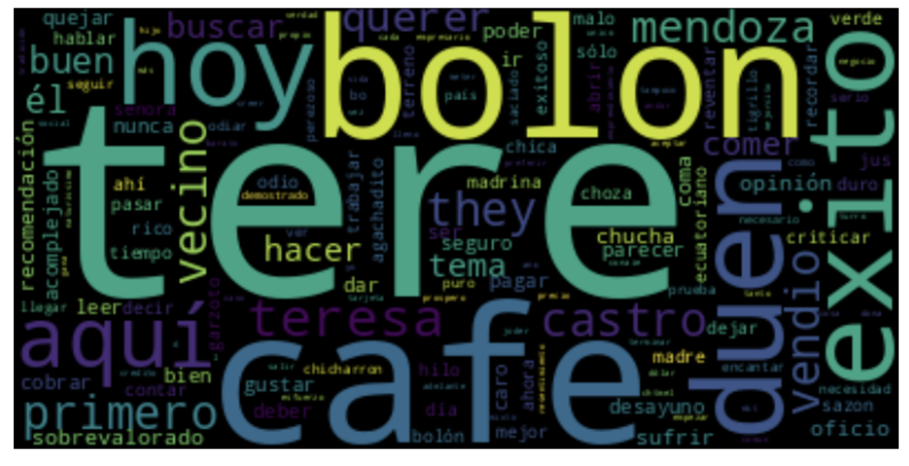
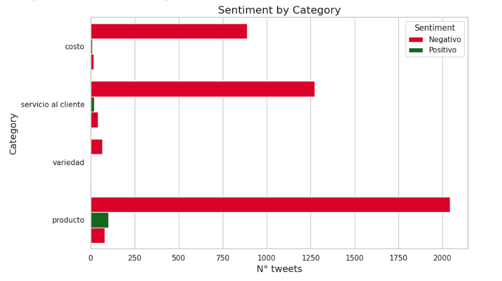

# Restaurant Social Media Sentiment Analysis

  

## 📊 Business Problem → Solution → Impact

**The Challenge:**  
A restaurant in Guayaquil, Ecuador needed to understand customer sentiment and identify growth opportunities from social media—but had no way to analyze unstructured Twitter data at scale.

**What I Built:**  
End-to-end NLP pipeline using Python that collects Twitter data, performs sentiment analysis, and delivers actionable business recommendations through word cloud visualization and social network analysis.

**Business Impact:**
- ✅ Identified recurring service complaints driving negative sentiment
- ✅ Discovered undermarketed menu items with strong positive feedback
- ✅ Mapped influencer accounts and peak engagement times
- ✅ Delivered 5 data-driven recommendations for immediate implementation

---

## 🔧 Technical Approach

**1. Data Collection:** Twitter API integration with geolocation filtering  
**2. Text Processing:** Cleaned Spanish-language tweets, removed noise, tokenization  
**3. Sentiment Analysis:** Classified tweets (positive/negative/neutral) using NLTK & TextBlob  
**4. Visualization:** Word clouds and frequency distributions to identify trends  
**5. Network Analysis:** Mapped conversation patterns and influencer relationships using NetworkX  

**Tech Stack:** Python • NLTK • TextBlob • Tweepy • NetworkX • Pandas • Matplotlib • WordCloud

---

## 📈 Sample Results

### Word Cloud: Most Discussed Topics

### Sentiment By Category

---

## 💡 Key Skills Demonstrated

✅ Natural Language Processing & Text Mining  
✅ API Integration & Data Collection  
✅ Statistical Analysis & Sentiment Classification  
✅ Data Visualization & Storytelling  
✅ Business Intelligence & Strategic Recommendations  
✅ Python Programming (Pandas, NLTK, NetworkX)  

---

## 🚀 View Full Analysis

[📓 Open Jupyter Notebook](./project_text_mining_and_social_network_analysis_module.ipynb)

---

## 📧 Contact

**Elena Jones** | 📧 [elcjones@proton.me] | 💼 [LinkedIn](https://www.linkedin.com/in/elenajoneslc/)

---

**This project demonstrates my ability to transform unstructured social media data into strategic business insights—the exact type of analysis that drives customer satisfaction and revenue growth.**
